===============
安装MicroPython
===============

安装HBFlash
======================

LinkIoT支持Arduino、Scratch和MicroPython编程。当我们需要使用LinkIoT进行MicroPython编程
或者某些特殊情况下（如固件升级、固件异常等情况）需要重新更新LinkIoT的Python固件时，就需要对LinkIoT
重新写入固件。那么就可以使用HBFlash应用程序方便快捷的刷入最新LinkIoT官方固件。

.. note:: HBFlash软件每次打开都会下载最新官方LinkIoT的MicroPython固件。

**************************
HBFlash Windows版本
**************************
HBFlash Windows点击 `HBFlash.exe`_ 下载。

.. _HBFlash.exe: http://www.hibottoy.com:8080/static/install/pc/windows/HBFlash/HBFlash.exe

**************************
HBFlash MacOS版本
**************************
HBFlash MacOS点击 `HBFlash.pkg`_ 下载， 运行HBFlash.pkg进行安装。

.. _HBFlash.pkg: http://www.hibottoy.com:8080/static/install/pc/mac/HBFlash/HBFlash.pkg

MacOS系统提示无法打开HBFlash.pkg
********************************
当MacOS系统提示无法打开“HBFlash.pkg”，因为它来自身份不明的开发者。如下图所示，需要修改系统设置打开HBFlash.pkg进行安装。

打开 系统偏好设置-安全与隐私-通用 界面，选择“仍要打开”

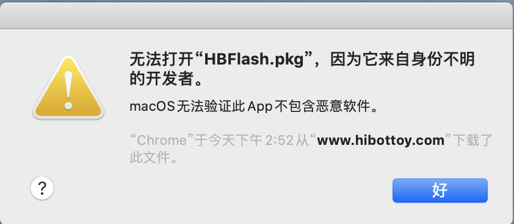
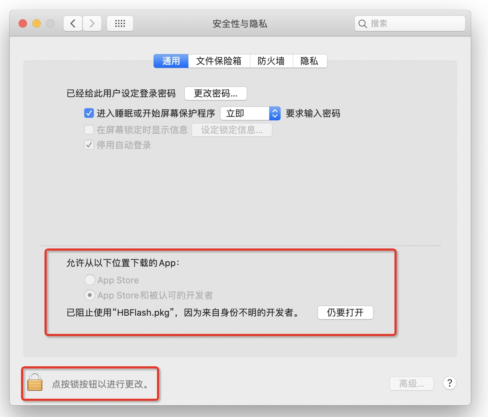
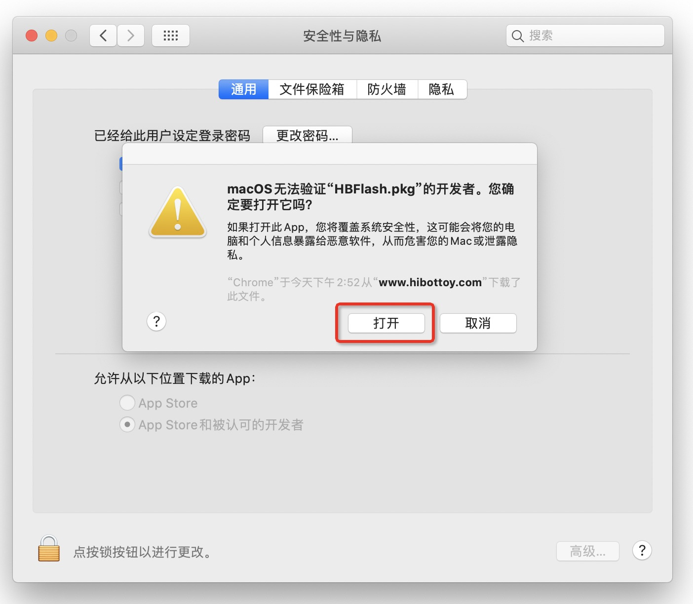

安装HBFlash.pkg
********************************

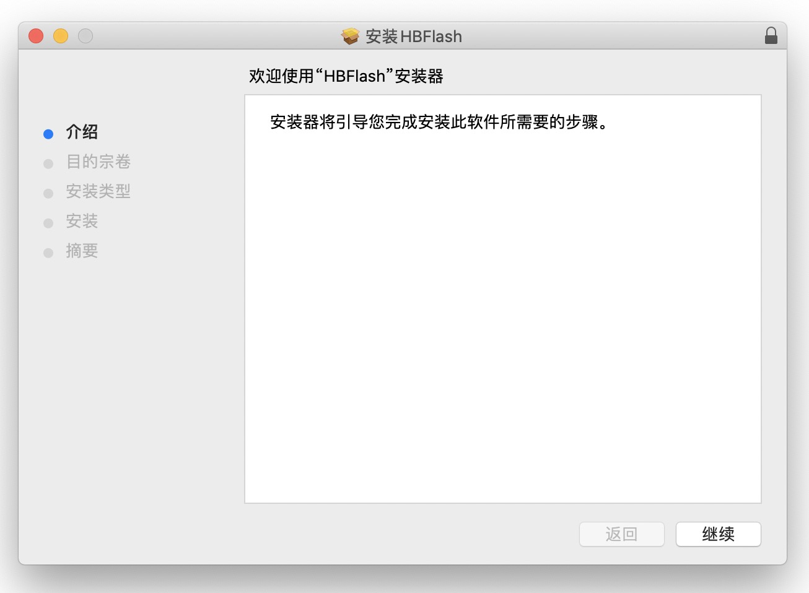
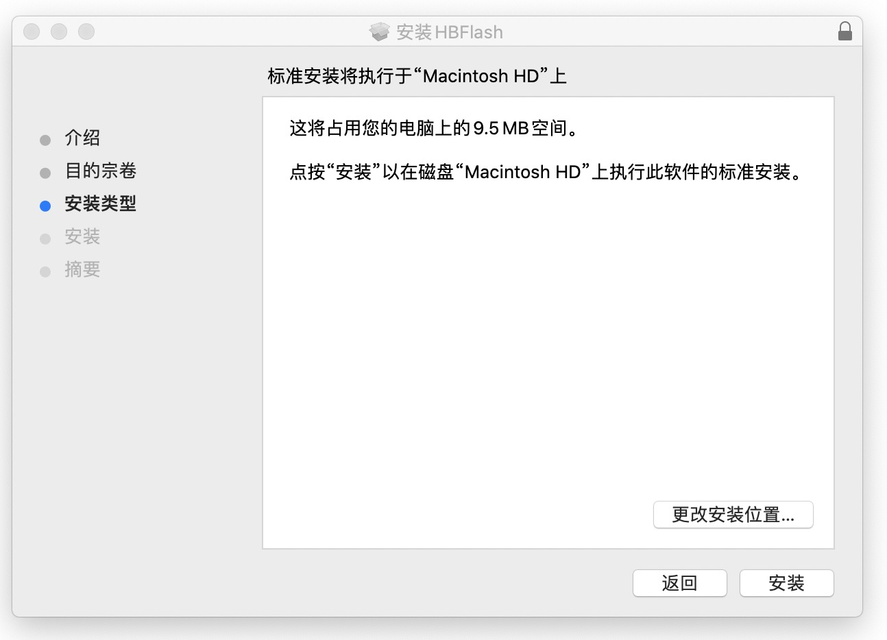
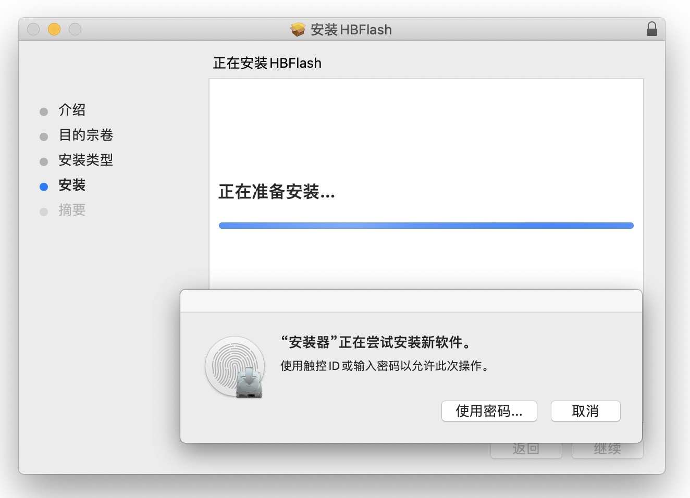
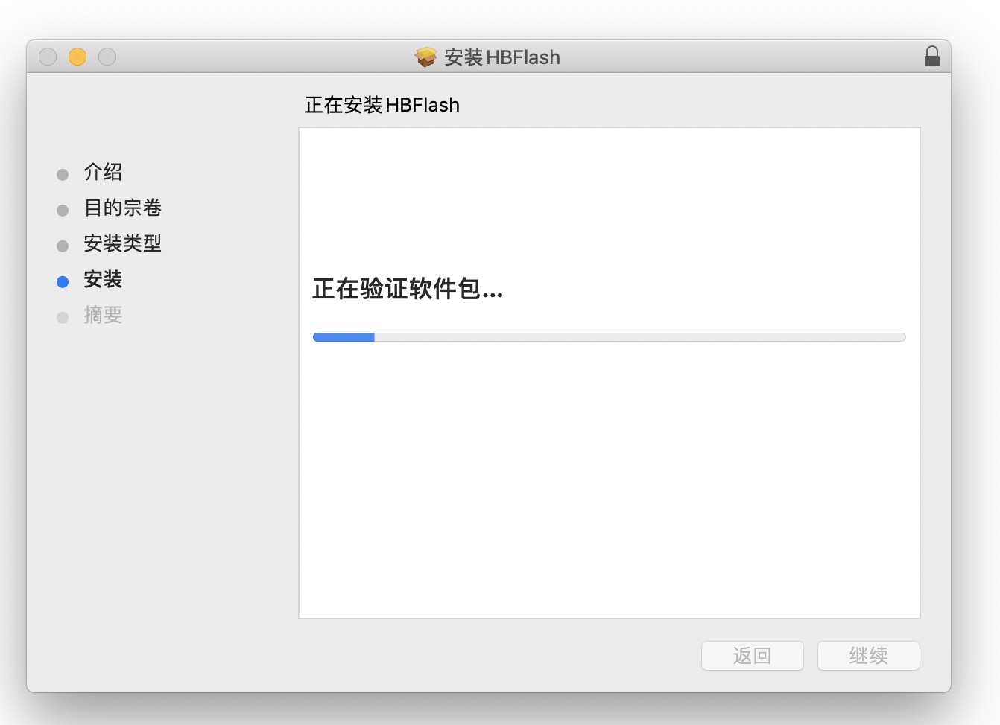
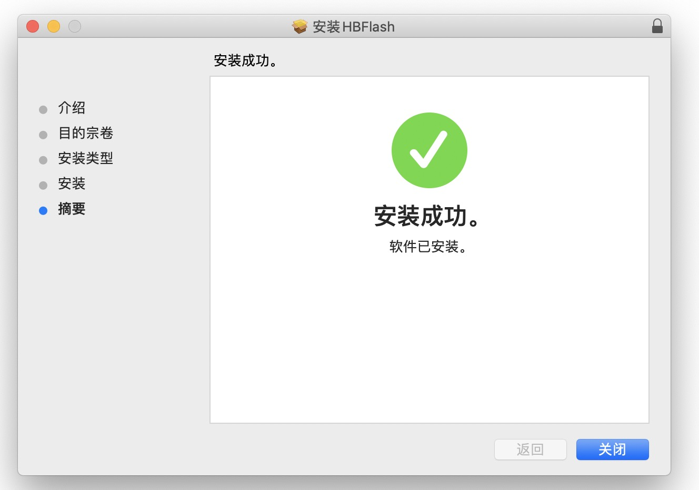

刷写LinkIoT MicroPython固件
===========================
使用HBFlash对LinkIoT刷写所支持的MicroPython固件。将HBLinkIoT通过USB线插入电脑，打开HBFlash应用程序，选择对应的USB串口，进行下载刷入固件。

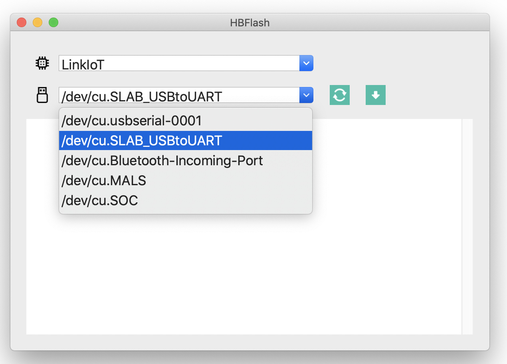
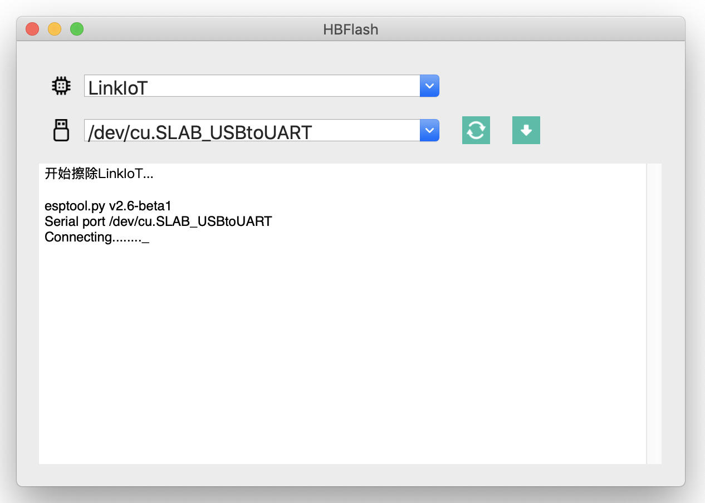
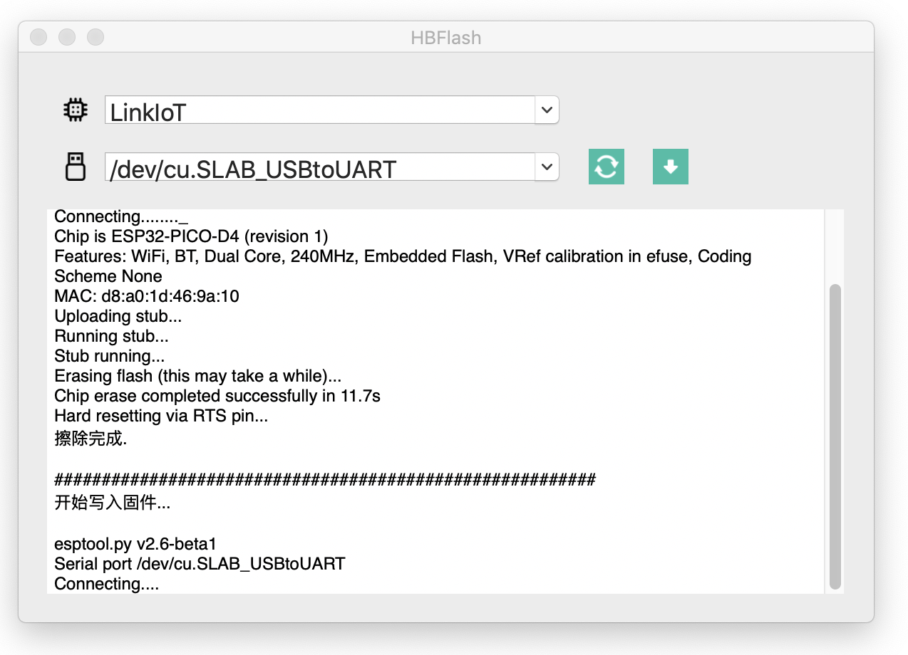
.. image:: _static/hbflash_mac_writing.png
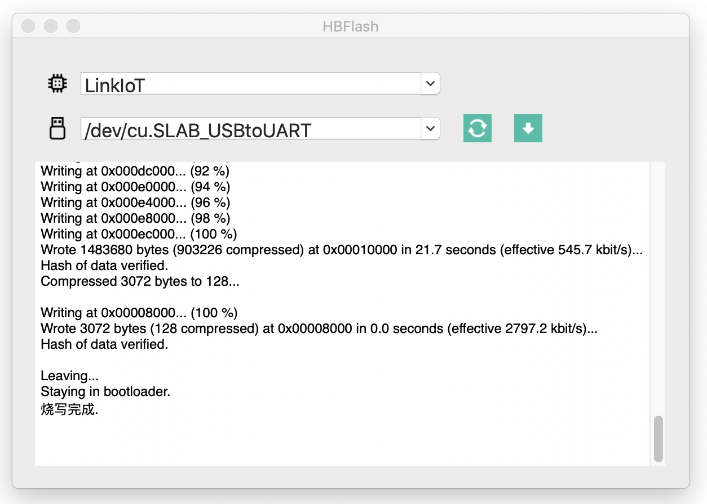